<!-- class: invert -->

# GitHub Codespaces 徹底活用 Hands-on

2023/01/20

---

# はじめに

---

## まずは Codespaces を起動しよう 1

リポジトリにアクセス

https://github.com/vscodejp/codespaces-handson

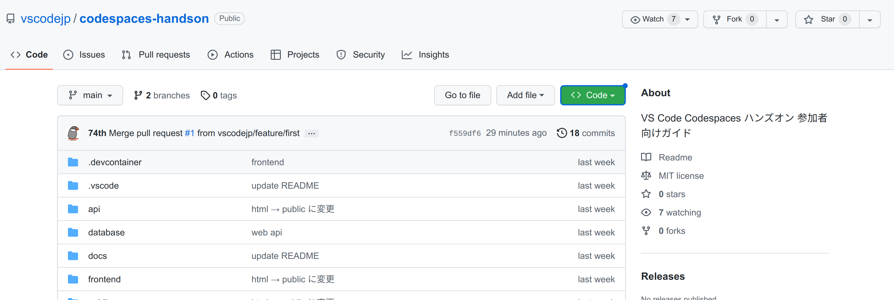

---

## まずは Codespaces を起動しよう 2

Code を押して、Code ボタン → Codespaces タブ → オプションボタン → New with options ...


---

## まずは Codespaces を起動しよう 3

支払い設定が所属企業ではなく、個人になっていることを確認しよう

オプションで 4-core に変更

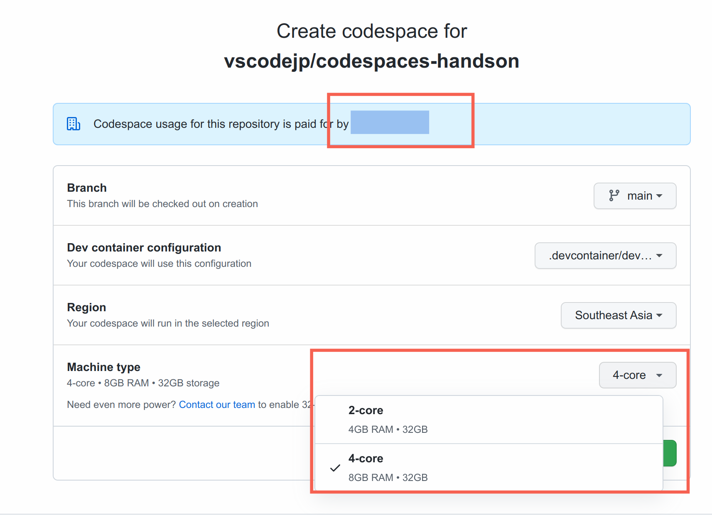

---

## まずは Codespaces を起動しよう 4

Web 版の起動が始まるけれど、ローカルの VS Code からつなごう！

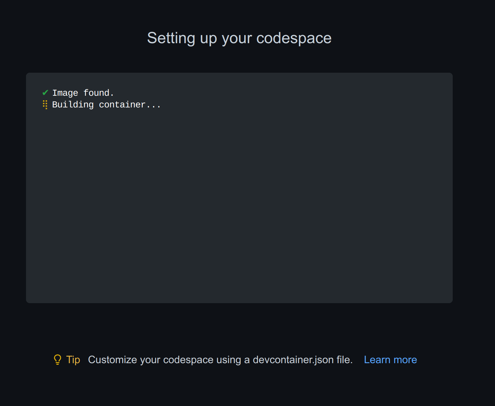

---

## まずは Codespaces を起動しよう 5

VS Code を起動して、GitHub Codespaces 拡張機能をインストールしていなければインストール。

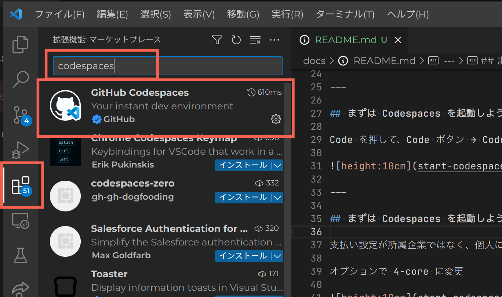

---

## まずは Codespaces を起動しよう 6

アクティビティーバーのリモートエクスプローラー（図の 1）をクリック。
上部のプルダウン（図の 2）から「GitHub Codespaces」を選択。
もし GitHub にサインインしていない場合、図の 3 が表示されるのでクリックして認証を進めよう。

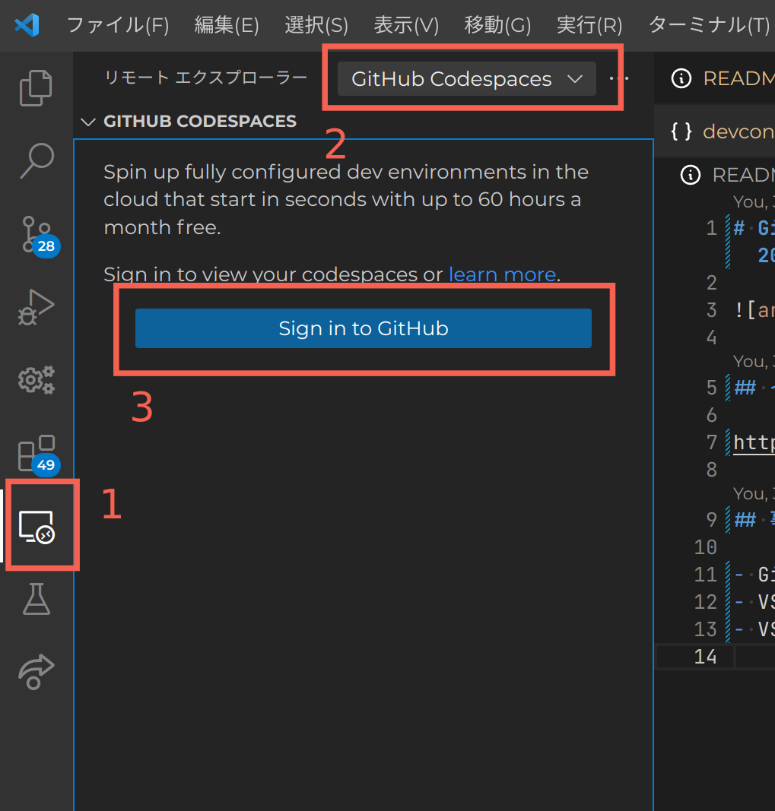

---

## まずは Codespaces を起動しよう 7

vscodejp/codespaces-handson の表示を確認して、接続ボタン（コンセントマーク）をクリック。

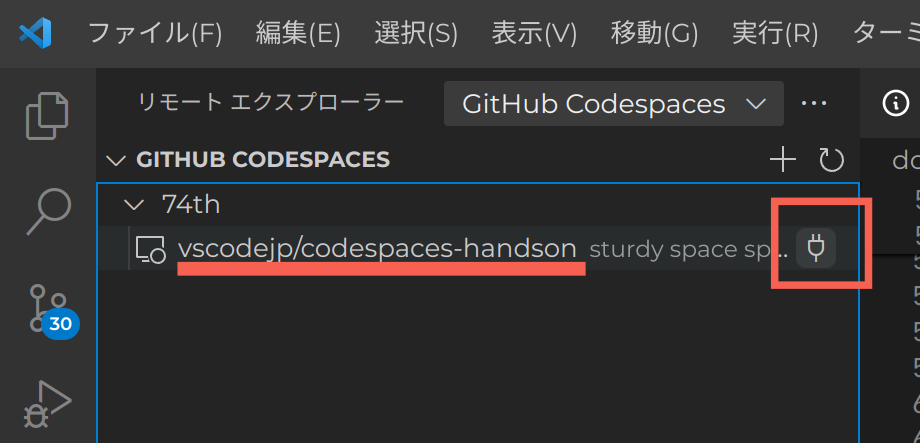

---

## 先に Codespaces の削除を学ぼう 1

方法 1。VS Code 中のリモートエクスプローラーから、削除したい Codespaces を右クリックして、Delete を選択。


---

## 先に Codespaces の削除を学ぼう 2

方法 2。GitHub のリポジトリページから。

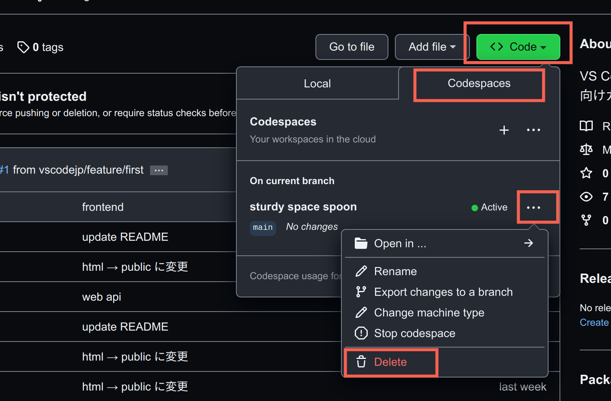

---

## 先に Codespaces の削除を学ぼう 2

方法 3。GitHub のヘッダーから、[Codespaces インスタンスの一覧ページ](https://github.com/codespaces)に飛べます。


---

## まずは座学へ

起動するまで別のお話を

☕☕☕

---

## GitHub Codespaces とは

VS Code の UI(Client)とコア機能(Server)を分離する「リモート開発機能」のうち、
Docker コンテナ内で VS Code Server を動かす「リモートコンテナ開発機能」で、
クラウド上のインスタンス上でコンテナを動かせるサービス。

手元の UI のマシンは非力でも、
クラウド上の潤沢なリソースを従量課金で利用できる。

---

## リモートコンテナ開発機能とは

Docker コンテナ上で VS Code Server を動かして開発する機能。

利用するコンテナを DevContainer と呼び、
開発環境に必要なツールを全てそのコンテナに格納する。

複数プロジェクトの作業している時に、
それぞれのプロジェクトのツールがそれぞれのコンテナの中に収まるので、
ツールが競合したりせず、クリーンに使える。

---

## リモートコンテナ開発機能で難しいところ

- DevContainer に全てのツールを入れる必要がある
  - 手順書ではなく、全て設定とスクリプトで書く必要がある

---

## 今回のアーキテクチャー

---

<!-- class: default -->


---

<!-- class: invert -->

## DevContainer の設定 1

- MySQL も起動する
- features で docker などツールをインストールする
- 必要なツールを Dockerfile でインストールする
- コンテナ起動後の初期化スクリプトを実行する
- 拡張機能をインストールする

---

## DevContainer の設定 2

.devcontainer/docker-compose.yml でコンテナを定義
MySQL コンテナが横で起動している

```json
// .devcontainer/devcontainer.json 抜粋
{
  "service": "app",
  "dockerComposeFile": "./docker-compose.yml"
}
```

```yaml
# .devcontainer/docker-compose.yml 抜粋
services:
  app:
    build:
      dockerfile: Dockerfile
  mysql:
    image: mysql/mysql-server:8.0.27
```

---

## DevContainer の設定 2

features で追加ツールをインストール。

feature のリスト → https://containers.dev/features

```json
// .devcontainer/devcontainer.json 抜粋
{
  "features": {
    // 追加 feature を指定
    // docker in docker
    "ghcr.io/devcontainers/features/docker-in-docker:2": {},

    // Python のパッケージマーネージャ Poetry
    "ghcr.io/devcontainers-contrib/features/poetry:1": {}
  }
}
```

---

## DevContainer の設定 5

docker-compose.yml からビルドする Dockerfile を指定している。
features だけでは不足するツールを追加している。
ストレージ費用が無料の Universal Container をベースにする。

```dockerfile
# .devcontainer/Dockerfile

# Universal Container image
FROM mcr.microsoft.com/devcontainers/universal:2-linux

# 追加でインストール
RUN apt-get update && apt-get install -y mysql-client-8.0
```

---

## DevContainer の設定 4

コンテナ起動後の初期化スクリプト（initialize.py）を実行

- Python、Nodejs のライブラリのインストール
- DB に初期データを投入

```json
// .devcontainer/devcontainer.json 抜粋
{
  "postCreateCommand": "./initialize.py"
}
```

---

## DevContainer の設定 3

拡張機能を複数インストール

```json
// .devcontainer/devcontainer.json 抜粋
{
  "extensions": [
    "cweijan.vscode-mysql-client2",
    "ms-python.python",
    "bungcip.better-toml",
    "humao.rest-client",
    "EditorConfig.EditorConfig",
    "spmeesseman.vscode-taskexplorer"
  ]
}
```

---

## MySQL につないでみよう 1

仕様

- host 名: mysql
- ユーザ名: root
- パスワード: なし
- データベース名: main
- テーブル名: tasks

---

## MySQL につないでみよう 2

アクティビティーバーから Database 選んで設定を作成


---

## MySQL につないでみよう 3

MySQL の設定をして、Connect を押して接続を確認しよう

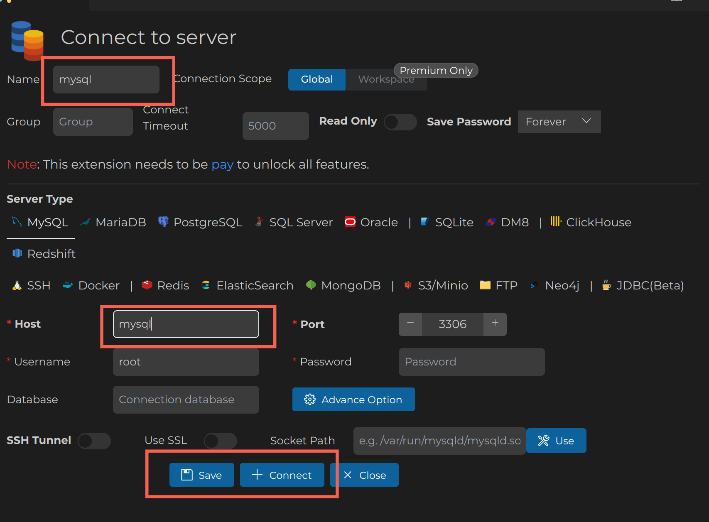

---

## MySQL につないでみよう 4

テーブルの中身を確認しよう。結構使えるツールなので、SQL を変更したり、レコード追加したりしてみよう！


---

## テーブルがない場合

初期化スクリプトを再実行しよう。アクティビティーバーからタスクエクエスプローラーを開いて、vscode のタスクから initialize db を実行しよう。

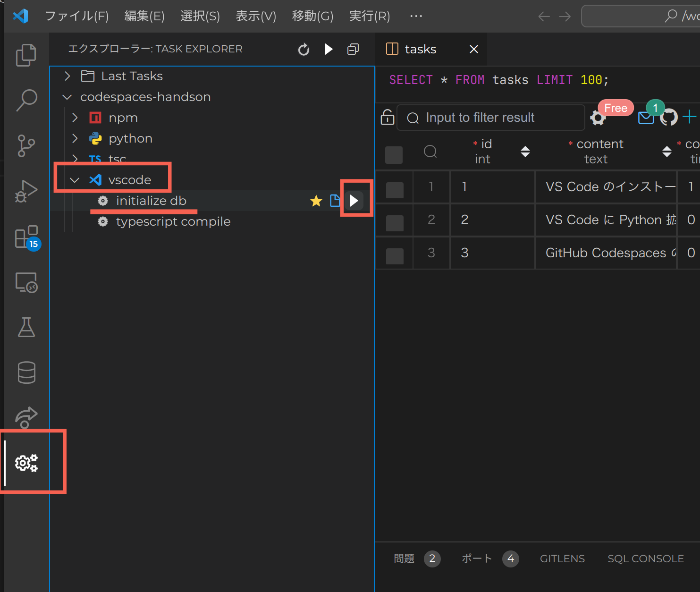

---

## アクティビティータブに database アイコンがない場合

自動インストールに失敗しているよ。F1 → Developer: Reload Window を実行する。

次の起動で、このワークスペースには水晶の拡張機能があります、というダイアログが右下に表示されるので、インストールを押す。

出ない場合、[.vscode/extensions.json](./../.vscode/extensions.json) にある拡張機能を拡張機能タブから検索してインストール。

---

## Python REST API Web Server

Python の REST API の Web Server が組まれているよ。
flask という WebServer のミドルウエアを利用しているよ。

[api/app.py](../api/app.py)

---

## Python Web Server の仕様

REST API は 3 つ実装されているよ。

1. 未完了のタスクの一覧を表示する `GET /api/tasks`
2. タスクを登録する `POST /api/tasks`
3. タスクを完了にする `POST /api/tasks/<タスクのID>/done`

---

## Python Server を起動してみよう

この Python をデバッグ実行しよう！
.vscode/launch.json にこのプログラムをデバッグ実行する設定が書かれているよ。
実行してみよう。

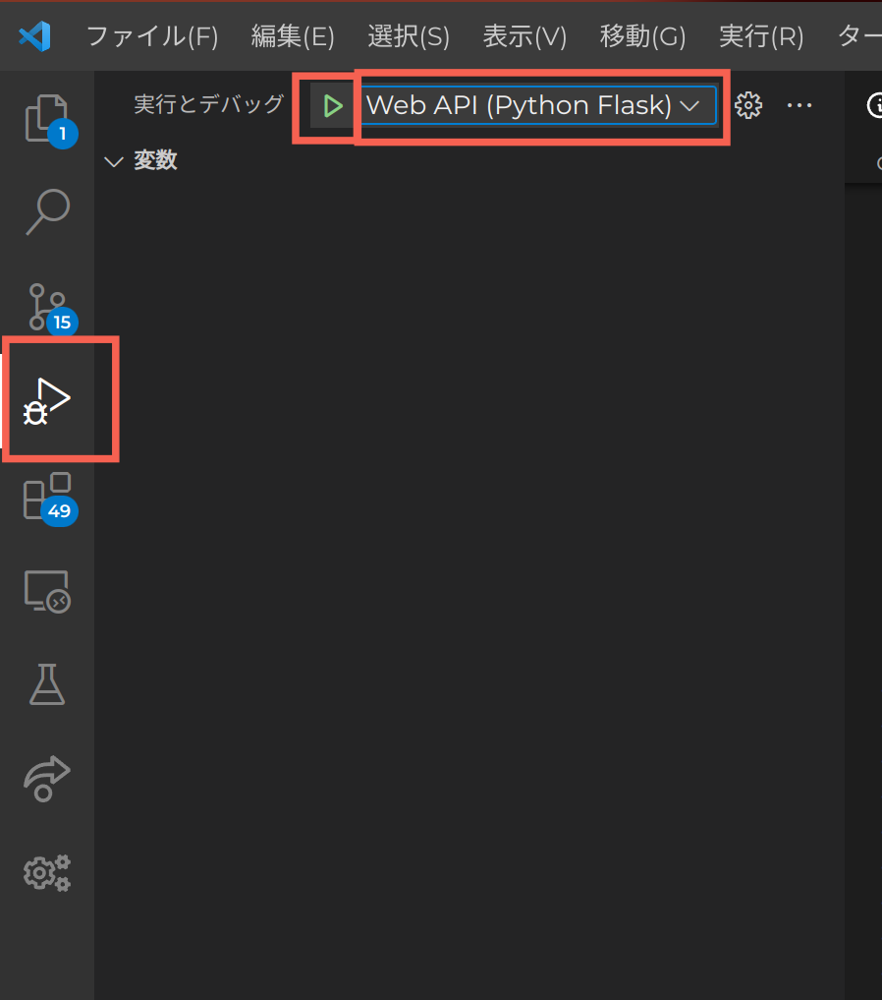

---

## デバッグ UI が登場

デバッグ実行に成功している場合、デバッグ UI が表示されるよ。


---

## REST Client を使ってリクエストしてみよう

REST API をテストする設定がつくってあるよ。Send Request ボタンを押してリクエストしてみよう。
タスクの登録や完了もテストしてみよう。

[rest_client.http](../rest_client.http)


---

## ブレークポイントを設定してステップ実行してみよう 1

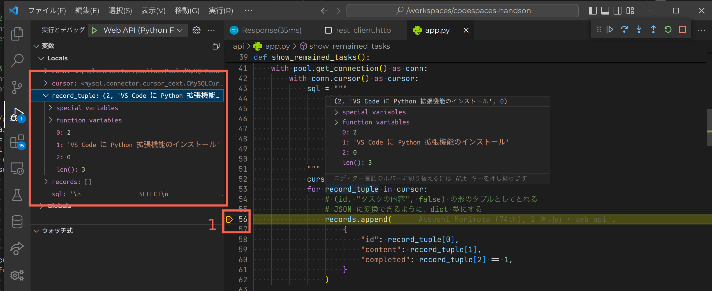

次のページに手順があるよ。

---

## ブレークポイントを設定してステップ実行してみよう 2

1. api.py の 56 行目の赤点の位置をクリックして、ブレークポイント追加
2. REST Client から GET /api/tasks のリクエストを実行
3. ブレークポイントで停止されたら、record_tuple の中身を確認
4. F5 を押して進めよう。3 レコードあれば、3 回止まるよ。

---

## デバッグ UI の使い方（再掲）


---

## フロントエンドの TypeScript を実行してみよう

- flask サーバは /api/ 以外にリクエストがあると、public/ にあるファイルを表示するよ。
- HTML: [public/index.html](../public/index.html)
  - public/js/main.js を読み込んむようになっているよ（まだないよ）
- frontend/main.ts API にアクセスして、UI を更新するプログラム

---

## フロントエンドの仕事 1

### タスク一覧表示 fetchTasks()

1. 画面表示時に fetchTasks() メソッドが呼ばれる
2. GET /api/tasks にアクセスしてタスクの一覧を取得
3. 取得した内容で HTML を更新

### タスクの登録 createTask()

1.  Add を押すと、createTask() メソッドが呼ばれる
2.  画面からタスクの入力を読み込み
3.  POST /api/tasks にアクセス
4.  fetchTasks() を呼んで、タスク一覧を再更新

---

## フロントエンドの仕事 2

### タスクの完了 completeTask()

1.  Done を押すと、completeTask() メソッドが呼ばれる
2.  POST /api/tasks/(id)/done にアクセス
3.  fetchTasks() を呼んで、タスク一覧を再更新

---

## フロントエンドのコンパイル 1

TypeScript を JavaScript にコンパイルするには以下のコマンドを実行。

```
npx tsc -w
```

すると、frontend/main.ts から public/js/main.js が作られるよ。

これが VS Code のタスク設定で組まれているよ。

[.vscode/tasks.json](../.vscode/tasks.json)

---

## フロントエンドのコンパイル 2


実行するとくるくるしたままになるよ。


---

## フロントエンドの実行 1

デバッグ設定が [.vscode/launch.json](../.vscode/launch.json) に組まれているよ。
「Launch Chrome」を実行しよう。


---

## フロントエンドの実行 2

```json
// .vscode/launch.json 抜粋
{
  "configurations": [
    {
      // Chrome でのフロントエンドのデバッグ
      "name": "Launch Chrome",
      "request": "launch",
      "type": "chrome",
      "url": "http://localhost:50120",
      "webRoot": "${workspaceFolder}/public"
    }
  ]
}
```

---

## フロントエンドの実行 2


---

## 画面が出ない場合 1 ポートを確認しよう

下部パネルのポートタブから、50120 ポートが、ローカルポートの何番になっているか確認しよう。

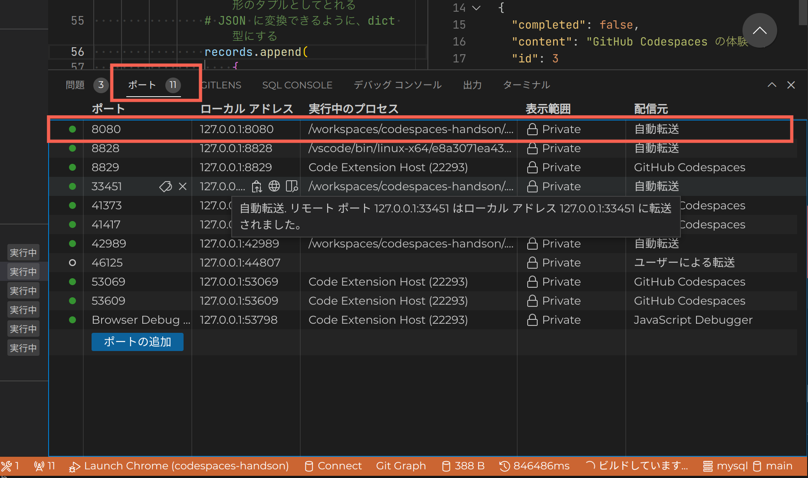

---

## 画面が出ない場合 2 Python デバッグが止まっていないか確認しよう

Python Server を起動してみよう参照してね。

---

## フロントエンドをデバッグしよう 1

frontend/main.ts の 49 行目にブレークポイントを設定


---

## フロントエンドをデバッグしよう 2

注目するところ

- あくまで JavaScript を実行しているけれど、TypeScript でデバッグできるよ
- public/js/main.js.map ファイルに対応関係が書かれているよ
- launch.json の

---

## Try 1: フロントエンドとサーバサイドを同時にデバッグしよう

フロントエンドとサーバサイドを連携してデバッグしてみよう。

---

## Try 2: 機能を追加してみよう

1. 完了したタスクを表示するボタンを作ってみよう (2h くらい)
2. 入寮項目に締め切りを追加して、締切順に表示できるようにしてみよう (2h くらい)

---

## 削除を忘れずに 1

方法 1。VS Code 中のリモートエクスプローラーから、削除したい Codespaces を右クリックして、Delete を選択。


---

## 削除を忘れずに 2

方法 3。GitHub のヘッダーから、[Codespaces インスタンスの一覧ページ](https://github.com/codespaces)に飛べます。


